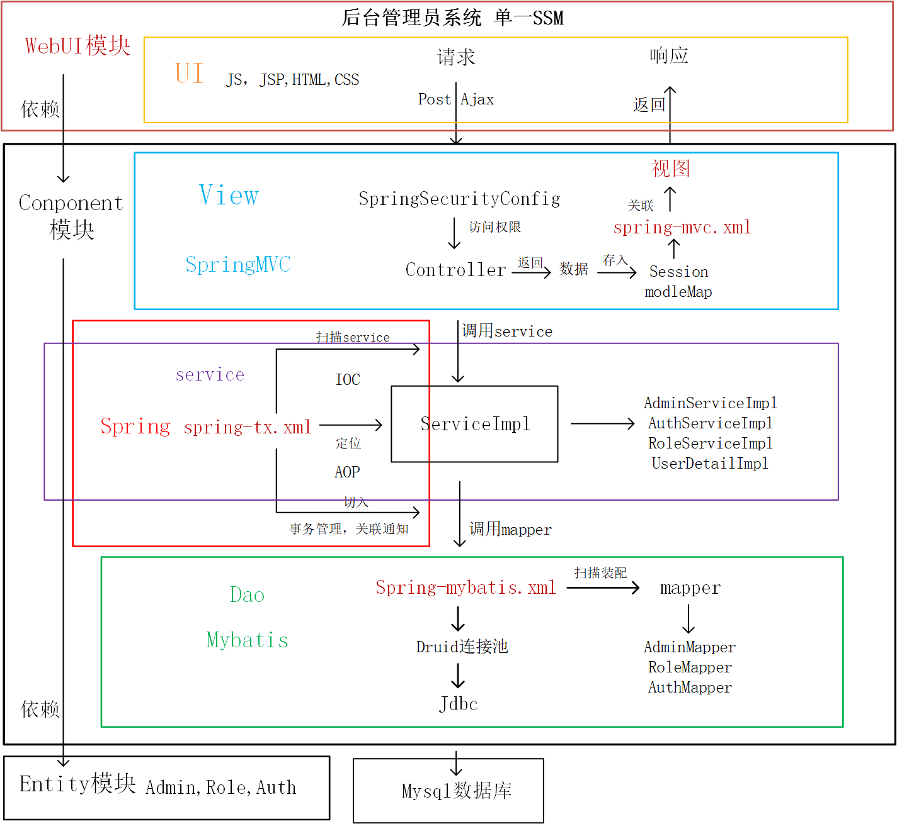
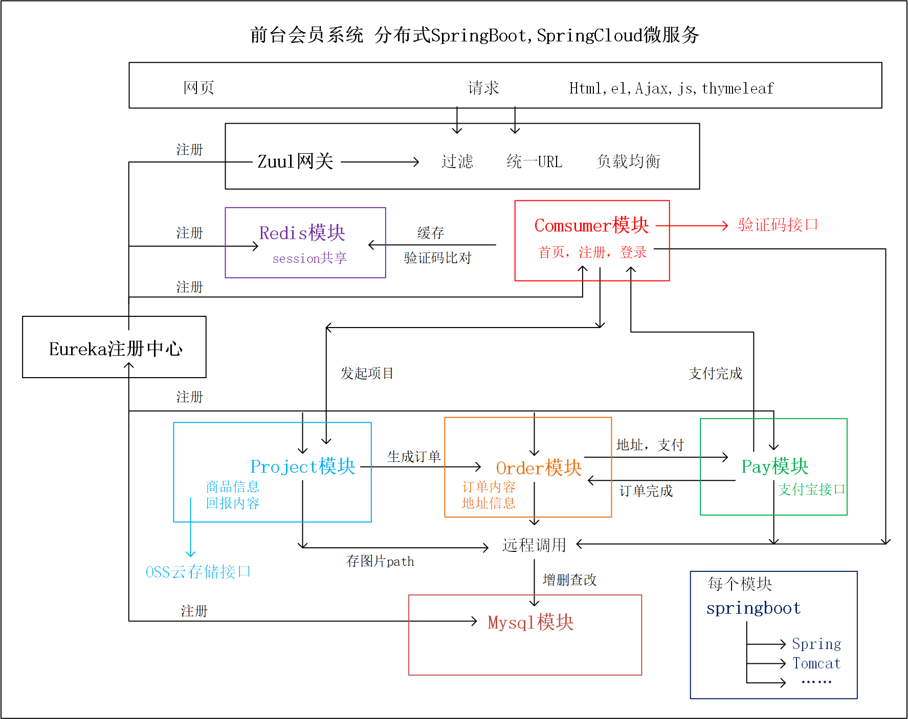

# credit
本项目是一个众筹项目，主要包括后台管理员系统和一个前台会员系统，
参考(尚筹网)

**后台管理员系统**： 基于Spring/mvc/mybatis的权限系统，实现了RABC的权限分配功能，注册登陆，基本角色的CRUD的权限分配，菜单管理  

**前台会员系统**： 基于springboot/mybatis/eureka，实现了zuul的鉴权登陆注册、项目发起、项目支持、订单生成、金额支付的功能
## 项目结构图如下：
[后台管理员系统](creditfunding-admin-parent)

[前台会员系统](creditfunding-member-parent)

